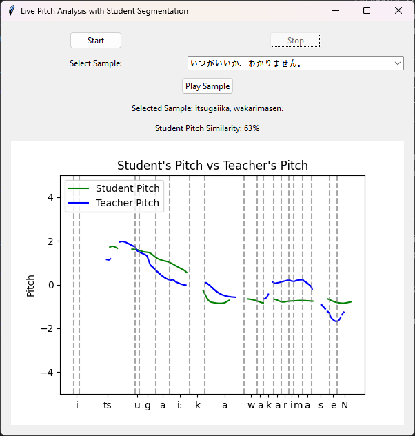

# Japanese Pronounciation Tool
## Problem
Japanese is a pitch accent language that poses challenges for beginners, particularly when mastering pronunciation. Beyond its tone-based nature, where subtle shifts in high and low pitches distinguish meaning—the language also demands precise tempo and vowel length. For example, pronouncing いい requires a quick, distinct articulation of two short "i" sounds, while いー calls for a longer, sustained vowel, much like differentiating between brief and extended phonemes.

Moreover, Japanese features phonemes that have no direct equivalent in English. The hiragana れ, for instance, represents an "r" sound that blends elements of both "l" and "d," further complicating pronunciation for learners. Given these challenges, from pitch accent to tempo nuances and unfamiliar phonemes, a specialized tool to aid in learning proper Japanese pronunciation would be highly beneficial.

## Solution
The tool is intended to help learners practice Japanese pitch accent at the sentence level by comparing their recordings with those of a native speaker. First, the system analyzes a pre-recorded sample by extracting its fundamental frequency, which represents the correct pitch accent pattern. After that, it records the student’s attempt of the same transcript. Because differences in speaking speed and timing make a direct comparison challenging, the system aligns the two recordings using dynamic time-warping (DTW) along with phoneme segmentation that relies on step functions aligned to phoneme boundaries. Additional methods, such as removing silence and filtering out outliers, help ensure a more precise visual comparison of the pitch patterns.

In practice, users can select sentences (sourced from Forvo), record their own attempts, and view a graph that compares their pitch contour with that of the teacher. The interactive interface, developed in Python with TTK, provides immediate visual feedback on pronunciation differences, making it a useful tool for improving one's Japanese pitch accent.

### Examples
In this example, I attempted to pronounce いつがいいか、わかりません。 The image below shows a visual comparison of my pitch accent pattern to that of a native speaker.

The analysis reveals that my recording is 63% similar to the teacher's, meaning that my pronunciation is acceptable but still has room for improvement, which is clearly visible in the pitch accent graph.